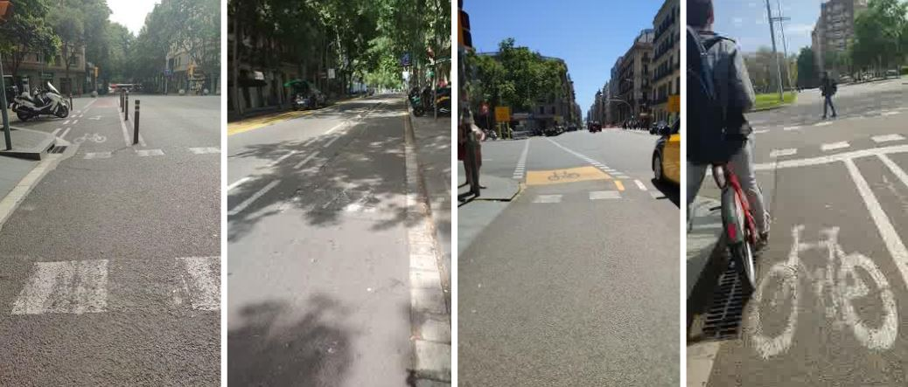
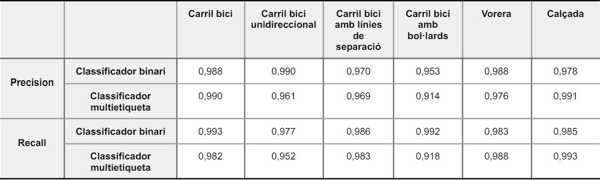
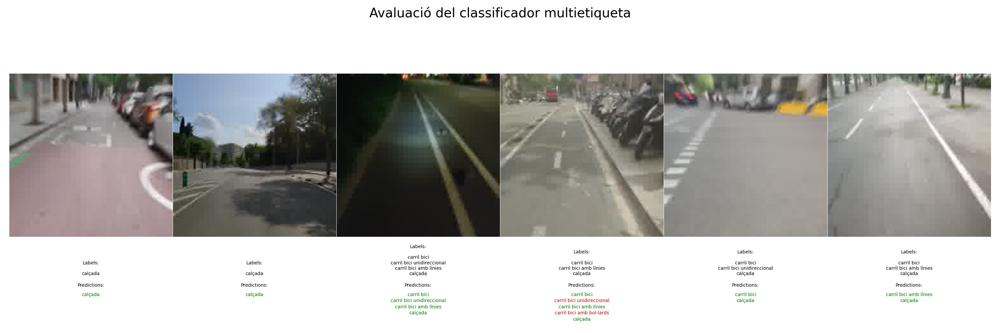

# DETERMINACIÓ DE CARACTERÍSTIQUES DE CARRILS BICI
Aquest repositori conté el codi utilitzat al projecte de determinació de característiques de carrils bici. Aquest projecte ha estat desenvolupat com a part del Treball de Fi de Grau a la Universitat Politècnica de Catalunya.

## Descripció del Projecte
L'objectiu principal d'aquest projecte és aplicar tècniques d'aprenentatge profund i visió per ordinador per identificar i classificar diverses característiques relacionades amb els carrils bici. Això té com a objectiu detectar possibles defectes i corregir-los, garantint així la seguretat dels usuaris. Per aconseguir-ho, s'han desenvolupat dues solucions principals: un classificador binari i un classificador multietiqueta.

### Objectius Específics
1. **Classificador binari:** Desenvolupar un model que identifiqui en imatges variades, relacionades amb el carril bici, una característica.
2. **Classificador multietiqueta:** Desenvolupar un model capaç d'identificar múltiples característiques en una sola imatge, com ara la presència de línies de separació en un carril bici, l'existència de bol·lards de seguretat, entre d'altres.

## Estructura del Repositori
El repositori està estructurat en carpetes de la manera següent:
```python
├── binary classifier 
│ ├── bikelane.py
│ ├── bollards.py
│ ├── lines.py
│ ├── road.py
│ ├── sidewalk.py
│ └── unidirectional.py
├── imatges
├── multilabel classifier
│ ├── labels.txt
│ └── multilabel_classifier.py
└── results
│ ├── binary classifier
│ └── multilabel classifier
```
### Descripció de Carpetes i Arxius
- **binary classifier**: Conté el codi de cada classificador binari que avalua diferents atributs individuals dels carrils bici.
 - `bikelane.py`: Inclou l'script amb el codi a Python per al classificador binari de la característica carril bici.
 - `bollards.py`: Inclou l'script amb el codi a Python per al classificador binari de la característica bol·lards.
 - `lines.py`: Inclou l'script amb el codi a Python per al classificador binari de la característica línies.
 - `road.py`: Inclou l'script amb el codi a Python per al classificador binari de la característica calçada.
 - `sidewalk.py`: Inclou l'script amb el codi a Python per al classificador binari de la característica vorera.
 - `unidirectional.py`: Inclou l'script amb el codi a Python per al classificador binari de la característica carril bici unidireccional.
 
- **images**: Conté les imatges utilitzades en aquest README.

- **multilabel classifier**: Conté el codi i les dades per al classificador multietiqueta que avalua múltiples atributs simultàniament.
- `labels.txt`: Inclou un fitxer de text amb les diferents rutes del conjunt de dades i les etiquetes corresponents.
- `multilabel_classifier.py`: Inclou l'script amb el codi a Python per al classificador multietiqueta.

- **results**: Conté els resultats gràfics dels dos classificadors.
- `binary classifier`: Inclou els resultats gràfics de cada classificador binari, de les mètriques accuracy, precision i recall.
- `multilabel classifier`: Inclou els resultats gràfics del classificador multietiqueta, de les mètriques accuracy, precision i recall


## Requisits i ús
Per executar aquest projecte, cal tenir Python i Pytorch instal·lats, ja que aquesta última és la biblioteca principal utilitzada en el desenvolupament.

Per executar els scripts corresponents a cada característica dins de la carpeta **binary classifier**, és important tenir en compte que el conjunt de dades es troba a *[ruta d'imatges](https://drive.google.com/drive/folders/1oOTvIPxk4Xk3Ro9I0M7ryafGINphkrnd?usp=sharing)*. Per tant, abans d'executar qualsevol dels sis classificadors, cal descarregar el conjunt de dades, col·locar-lo a la mateixa carpeta on es troben els scripts, i també cal emplenar els scripts amb la ruta de cada carpeta del conjunt de dades.

Quant a l'script per al **multilabel classifier**, no cal descarregar el conjunt de dades, ja que el fitxer de text en aquesta carpeta inclou la ruta de cada imatge utilitzada.

Exemples d'imatges trobades al conjunt de dades:


_Figura 1: Exemple d'imatges del tipus bikelane_

## Detalls tècnics
### Classificador binari
El classificador binari està basat en una xarxa neuronal convolucional (CNN) que ha estat entrenada per distingir diferents característiques dels carrils bici. Els passos per desenvolupar aquest classificador inclouen:

1. **Preprocessament de Dades:** Les imatges d'entrada, enfocades principalment als carrils bici, es redimensionen i normalitzen.
2. **Arquitectura del Model:** S'utilitza una arquitectura de CNN estàndard amb diverses capes de convolució, pooling i capes completament connectades.
3. **Entrenament:** El model s'entrena utilitzant una funció de pèrdua binària i un optimitzador Adam.
4. **Avaluació:** El rendiment del model s'avalua utilitzant mètriques com accuracy, precision, recall i f1-score.

### Classificador multietiqueta
El classificador multietiqueta utilitza una CNN semblant, però amb una capa de sortida que permet la predicció de múltiples etiquetes. Els passos per desenvolupar aquest classificador inclouen:

1. **Preprocessament de dades:** Les dades d'entrada són imatges de carrils bici etiquetades amb múltiples atributs. Aquestes imatges també es redimensionen i normalitzen.
2. **Arquitectura del Model:** S'utilitza una CNN que prediu la presència o absència de cada etiqueta.
3. **Entrenament:** El model s'entrena utilitzant una funció de pèrdua d'entropia creuada binària per a cada etiqueta i un optimitzador Adam.
4. **Avaluació:** El rendiment del model s'avalua utilitzant mètriques com accuracy, precision, recall i f1-score.

## Resultats
Els resultats gràfics de l'entrenament i l'avaluació dels models es poden trobar a la carpeta `results`.

### Classificador binari
- **Accuracy:**
 - `carril bici`: 97,9%
 - `carril bici unidireccional`: 96,8%
 - `carril bici amb línies marcades`: 96,2%
 - `carril bici amb bol·lards`: 96,5%
 - `vorera`: 97,6%
 - `calçada`: 97%

- **Precision i Recall:**
 - `carril bici`: 98,8% i 99,3%
 - `carril bici unidireccional`: 99% i 97,7%
 - `carril bici amb línies marcades`: 97% i 98,6%
 - `carril bici amb bol·lards`: 95,3% i 98,3%
 - `vorera`: 98,8% i 98,3%
 - `calçada`: 97,8% i 98,5%

### Classificador multietiqueta
- **Accuracy:** El resultat de la mètrica accuracy del classificador multietiqueta complet és de 95,8%

- **Precision i Recall:**
 - `carril bici`: 99% i 98,2%
 - `carril bici unidireccional`: 96,1% i 95,2%
 - `carril bici amb línies marcades`: 96,9% i 98,3%
 - `carril bici amb bol·lards`: 91,4% i 91,8%
 - `vorera`: 97,6% i 98,8%
 - `calçada`: 99,1% i 99,3%



_Figura 2: Resultats dels mètodes precision i recall pels dos classificadors_

## Resultats visuals


_Figura 3: Resultats del classificador multietiqueta_

## Contacte
Per a qualsevol dubte o consulta, pots contactar amb:
- **Autor**: Sandra Jessica Chávez Olano
- **Email**: sandra.jessica.chavez@estudiantat.upc.edu 
